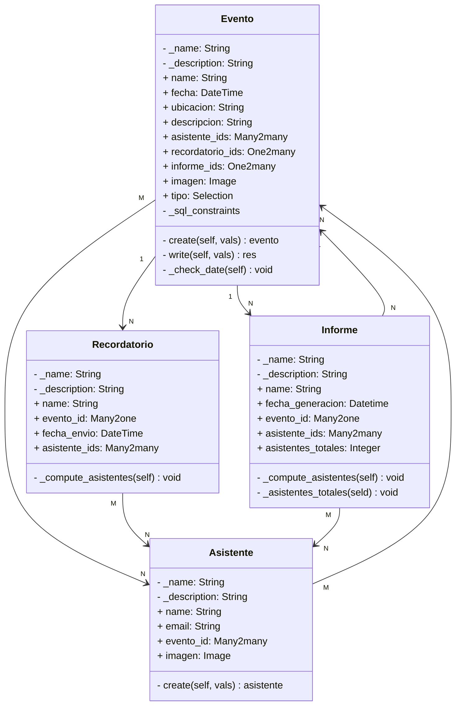
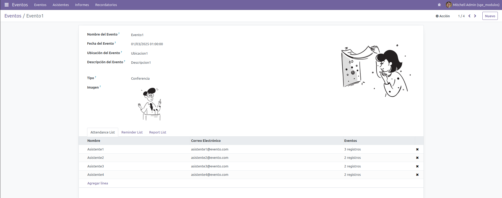

# Módulo de Odoo: Gestión de Eventos

## 1. Introducción

Esta memoria detalla el desarrollo de un módulo para Odoo. El módulo está diseñado para gestionar eventos, incluyendo la creación y administración de eventos, asistentes, informes y recordatorios. Este documento proporciona una visión general de las funcionalidades implementadas, los problemas encontrados, las soluciones aplicadas y las mejoras sugeridas.

## 2. Objetivos del Módulo

El objetivo principal del módulo es permitir a los usuarios de Odoo gestionar eventos de manera eficiente. Las funcionalidades principales incluyen la creación de eventos, registro de asistentes, generación de informes y configuración de recordatorios automáticos. Además, se busca proporcionar una interfaz intuitiva y funcionalidades sólidas para facilitar la gestión de eventos.

## 3. Actividades realizadas

### Relaciones UML

Estas relaciones, representan las interacciones que tienen los distintos modelos del modulo entre sí, y además todos los atributos y funciones que tienen.

### Modelos de datos

1. `Asistente`: Permite registrar asistentes a eventos con información como nombre y correo electrónico. Tiene una función que permite crear un usuario de res.users con los datos del asistente y además se añade a los grupos base y asistente para tener los permisos de dichos grupos sobre el módulo.
2. `Evento`: Permite la creación de eventos con campos como nombre, fecha, ubicación, descripción y tipo. Este modelo tiene varias funcionalidades:
    1. Crear un recordatorio automático cuando se crear un nuevo evento. El recordatorio en si se crea con el nombre del evento, su id y la fecha de envío se calcula a tres días antes de la celebración del evento.
    2. Cambiar la fecha de envío de recordatorio en caso de que se modificara la fecha de celebración del evento a 3 días antes de dicha fecha.
    3. Verificación de que la fecha del evento es como mínimo posterior al día actual.
    4. Verificación de que el nombre y la descripción del evento son distintos.
3. `Informe`: Permite generar informes asociados a eventos con un nombre y una fecha de generación automática al momento que se crea el informe. Contiene un campo calculado que calcula el total de asistentes del evento seleccionado. Dicho campo se utiliza en la impresión del informe.
4. `Recordatorio`: Permite configurar recordatorios para eventos con campos como nombre, evento, descripción y fecha de recordatorio. 

Tanto en los modelos informe y recordatorio, se muestran los asistentes del evento escogido sin posibilidad de modificarlos. Además, en caso de borrado del evento asignado, se borran ambos en cascada.

### Vistas XML

Todos los modelos anteriormente mencionados tienen su vista formulario y lista, pero dos de ellos tienen vistas específicas:

- **Evento**:
    - **Vista form**: contiene un notebook con las tres listas que contiene de relaciones (asistentes, recordatorio e informes).
        
        
        
    - **Vista kanban sencilla**: separado por tipos de evento para una mejor visibilidad de los eventos de cada tipo que hay. En esta vista, la imagen que está al lado de la información del evento, es la imagen que tiene el evento como atributo y que el usuario escoge a su elección. Muestra toda la información del evento a excepción de los recordatorios e informes.
        
        
        
    - **Calendario**: muestra todos los eventos registrados. Si pincháramos sobre el evento deseado, saldría información sobre el evento (nombre, ubicación, descripción y asistentes).
        
        
        
    - **Búsqueda**: filtra por los próximos eventos registrados.

		

		

- **Informe**:
    - **Form / Report**: Contiene un notebook para ver los asistentes del evento y además la posibilidad de poder imprimirlo como informe.
        
        
        
        
        

### Permisos / Seguridad

Para este módulo, he desarrollado un grupo de asistentes específico con permisos de lectura y creación. Además de ese grupo, he considerado que los integrantes del grupo administradores tengan control total y los usuarios internos solo tengan permitido leer. 

Solo el grupo de usuarios administradores tienen acceso a todos los menús del módulo, ya que desde el formulario de eventos se ve toda la información referida a informes, asistentes y recordatorios desde el mismo en el notebook.

### Datos demo

Para poder tener datos con los que probar acciones, he creado 3 eventos demo, 4 asistentes relacionados a dichos eventos y un informe. No es necesario contemplar la opción de poner datos demo de recordatorio ya que se crean automáticamente con la creación de los eventos.

### Traducción

Se han proporcionado traducciones para los campos y etiquetas del módulo para mejorar la experiencia del usuario en inglés.

### 4. Problemas Encontrados

- **Creación de permisos para los asistentes:** El primer enfoque fue crear un grupo de solo lectura pero al tener menos permisos que el grupo de usuarios base, se sobrescribía. Le di otro enfoque pensando en que podría dar la oportunidad a los asistentes de registrar eventos sin poder editarlos y que los usuarios base solo pudieran ver el contenido general.
- **Warning de report deprecado**: al querer poner la funcionalidad de imprimir el informe, lo hice con la etiqueta report. Dicha etiqueta da un warning ya que está deprecada y te sugiere que uses mejor record. Al cambiar todos los atributos del report al record, deja de salir la opción de imprimir. Decidí al final dejarlo con report ya que sino pierdo la funcionalidad corriendo el riesgo de que deje de funcionar.

### 5. Sugerencias de Mejora

Para mejorar el módulo se sugieren las siguientes mejoras:

- Mejora de la interfaz de usuario para una experiencia más intuitiva y amigable.
- Incorporación de más opciones de configuración y personalización como herencia en los asistentes para poder separar asistentes de trabajadores del propio evento.

### 6. Conclusiones Personales

El desarrollo de este módulo ha sido una experiencia enriquecedora que ha permitido adquirir un mayor conocimiento sobre Odoo y sus capacidades de desarrollo de módulos. A pesar de los desafíos encontrados, el resultado final es un módulo funcional que cumple con los requisitos establecidos.

### 7. Referencias Bibliográficas

- [https://www.odoo.com/documentation/16.0/es/](https://www.odoo.com/documentation/16.0/es/)
- [https://www.odoo.com/forum/help-1](https://www.odoo.com/es_ES/forum/ayuda-1)
- [https://www.sygel.es/blog/blog-de-sygel-2/reglas-y-permisos-de-acceso-en-odoo-65#](https://www.sygel.es/blog/blog-de-sygel-2/reglas-y-permisos-de-acceso-en-odoo-65#)

Esta memoria resume el proceso de desarrollo y las características del módulo de gestión de eventos desarrollado para Odoo. Se espera que este documento sirva como referencia para futuras mejoras y extensiones del módulo.